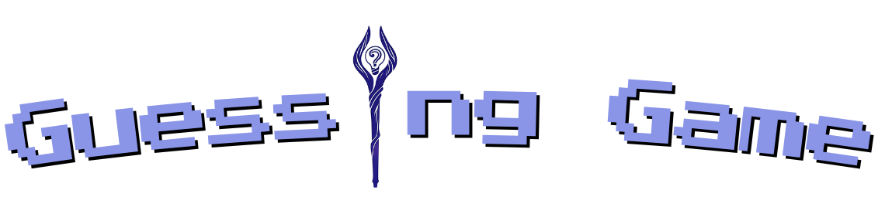

<h1 align="center">🎮 Jogo de Adivinhação Temático ✨ </h1>

<p align="center">
  
</p>

Bem-vindo ao Jogo de Adivinhação Temático! Um projeto web interativo e divertido onde você testa sua sorte para adivinhar um número secreto. A experiência é enriquecida com uma seleção de temas visuais dinâmicos inspirados no anime "Frieren", que alteram a interface antes mesmo de começar a jogar!

## Índice

*   [Sobre o Projeto](#sobre-o-projeto)
*   [Tecnologias Utilizadas](#tecnologias-utilizadas)
*   [Funcionalidades Implementadas](#funcionalidades-implementadas)
*   [Como Executar o Projeto Localmente](#como-executar-o-projeto-localmente)
*   [Estrutura do Projeto](#estrutura-do-projeto)
*   [Contato](#contato)

## Sobre o Projeto

O objetivo principal deste projeto é oferecer uma experiência de jogo de adivinhação simples, divertida e visualmente envolvente. Através da seleção de temas inspirados no anime "Frieren" (com os personagens Frieren, Stark e Fern), o usuário pode personalizar a aparência do jogo, tornando a interação mais dinâmica e imersiva.
O foco está na interatividade da interface, na mudança visual baseada na escolha do tema e na lógica clássica de um jogo de adivinhação de números.
## Tecnologias Utilizadas

Este projeto foi construído utilizando as seguintes tecnologias front-end:

*   *HTML5:*
*   * Utilizado para a estrutura semântica das páginas (tela de seleção de tema e telas de jogo).
*   *CSS3:*
    *  Empregado para estilização e layout.
    * Inclui o uso de Flexbox para organização dos elementos.
    * Transições CSS para os efeitos dinâmicos de mudança de fundo e estilo de texto na seleção de tema.
    * Estilização específica para cada tema de personagem.
*   *JavaScript:*
    * Responsável por toda a lógica do jogo e interatividade.
    * Manipulação do DOM para alterar dinamicamente os estilos e fundos na seleção de tema.
    * Navegação entre a tela de seleção e as páginas de jogo.
    * Geração do número secreto.
    * Verificação dos palpites do usuário e contagem de tentativas.
    * Exibição de feedback (dicas, mensagens de vitória/derrota).
    * Funcionalidade de reiniciar o jogo e voltar ao menu.
    * Validação de entrada do usuário.

## Funcionalidades Implementadas

*   *Tela de Seleção de Tema Interativa:*
    *   Apresentação de 3 personagens (Frieren, Stark, Fern) para escolha do tema.
    *   Ao passar o mouse sobre um personagem, o plano de fundo da página e o estilo do título principal mudam dinamicamente para refletir o tema do personagem.
    *   Ao clicar em um personagem, o usuário é redirecionado para a página de jogo correspondente àquele tema.
*   *Mecânica Clássica de Jogo de Adivinhação:*
    *   Geração de um número secreto aleatório entre 1 e 50.
    *   O jogador tem 10 tentativas para adivinhar o número.
*   *Feedback em Tempo Real e Controles do Jogo:*
    *   Dicas informando se o palpite é maior ou menor que o número secreto.
    *   Exibição do número de tentativas restantes.
    *   Mensagens claras de vitória ou derrota ao final da partida.
    *   Botões para "Verificar" palpite, "Reiniciar Jogo" e "Voltar ao Menu".
    *   Validação para garantir que o usuário insira um número válido dentro do intervalo.
*   *Design Temático:*
    *   Páginas de jogo (frieren.html, stark.html, fern.html) com visuais consistentes com o tema escolhido.


## Como Executar o Projeto Localmente

Para visualizar este projeto em sua máquina local:

1.  *Clone o repositório (se estiver hospedado no GitHub, GitLab, etc.):*
    
    ```text
    git clone https://lorena-rinaldo.github.io/Adivinhe-o-Numero/
    ```
    
     ```text
    cd Adivinhe-o-Numero
     ```
    
    Se você já possui os arquivos localmente, pode pular esta etapa.

3.  **Abra o arquivo index.html:**
    *   Navegue até a pasta raiz do projeto no seu explorador de arquivos.
    *   Abra o arquivo index.html em qualquer navegador web moderno (como Google Chrome, Firefox, Edge).

## Estrutura do Projeto
```text
A estrutura de arquivos e pastas do projeto está organizada da seguinte forma:

.
├── index.html             # Tela inicial de seleção de tema
├── css/
│   └── style.css          # Folha de estilos principal (incluindo estilos temáticos)
├── js/
│   └── main.js            # Lógica da seleção de tema e do jogo de adivinhação
├── pages/
│   ├── frieren.html       # Página do jogo com tema Frieren
│   ├── stark.html         # Página do jogo com tema Stark
│   └── fern.html          # Página do jogo com tema Fern
├── assets/
│   ├── frieren.png        # Imagem do personagem Frieren para seleção
│   ├── stark.png          # Imagem do personagem Stark para seleção
│   ├── fern.png           # Imagem do personagem Fern para seleção
│   ├── fundoFrieren.png   # Imagem de fundo para o tema Frieren
│   ├── fundoStark.png     # Imagem de fundo para o tema Stark
│   ├── fundoFern.png      # Imagem de fundo para o tema Fern
│   └── [seu_screenshot.png] # Seu screenshot para o README (substitua o nome)
└── README.md             
```
## Contato

Desenvolvido por: *Lorena Rinaldo Moreira*

*   GitHub: https://github.com/Lorena-Rinaldo
*   LinkedIn: www.linkedin.com/in/lorena-rinaldo01
*   Email: lorena.rinaldodev@gmail.com

---

🎮 Divirta-se adivinhando e explorando os temas! ✨
